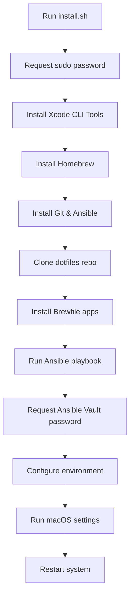

# macOS Automated Setup Guide

This repository contains an automated macOS setup system that uses Ansible to configure a new Mac with your preferred development environment, applications, and settings.

## 🚀 Quick Start

**One command setup:**
```bash
bash <(curl -sL https://raw.githubusercontent.com/sidkhuntia/dotfiles-mac/main/install.sh)
```

## 📋 What This Setup Does

### 1. **System Dependencies**
- Installs Xcode Command Line Tools
- Installs Homebrew package manager
- Installs Git and Ansible

### 2. **Applications & Tools** (via Brewfile)
- **Development Tools**: VSCode, iTerm2, Docker, Git, Go, Node.js, Python
- **Productivity**: Raycast, Rectangle, Obsidian, Bitwarden
- **Communication**: Discord, Telegram, WhatsApp, Zoom
- **Browsers**: Chrome, Firefox, Arc
- **Utilities**: Stats, Lunar, BetterDisplay, Caffeine, Shottr
- **Media**: Spotify, VLC
- **CLI Tools**: bat, fzf, lazydocker, tree, zoxide, hyperfine

### 3. **Development Environment** (via Ansible)
- **Zsh Configuration**: Oh My Zsh with custom plugins and Powerlevel10k theme
- **Git Configuration**: Multiple profiles (personal/work) with SSH key management
- **Node.js**: NVM setup with global packages
- **Go**: Latest version installation
- **Dotfiles**: Symlinked configuration files using GNU Stow

### 4. **Credentials & Keys**
- SSH keys for GitHub (personal/work)
- AWS credentials
- Various service backup codes (2FA)
- Raycast configuration

### 5. **macOS System Settings**
- Finder preferences (show hidden files, path bar, status bar)
- Dock configuration (autohide, minimize to app)
- Screenshot format settings
- Disable startup sound
- Time Machine preferences

## 🔧 Setup Process Flow



## 🔑 Required Inputs

During setup, you'll be prompted for:

1. **Sudo Password**: Your macOS admin password (multiple times)
2. **Ansible Vault Password**: Password to decrypt sensitive configuration files
3. **System Restart Confirmation**: Whether to restart after setup

## 📁 Repository Structure

```
dotfiles-mac/
├── install.sh              # Main installation script
├── setup.sh                # macOS system configuration
├── Brewfile                 # Homebrew packages and apps
├── scripts/
│   ├── osx.sh              # macOS defaults configuration
│   └── utils.sh            # Utility functions
├── ansible/
│   ├── playbook.yml        # Main Ansible playbook
│   ├── inventory           # Localhost configuration
│   ├── group_vars/         # Global variables
│   ├── roles/              # Ansible roles
│   │   ├── zsh/           # Zsh shell configuration
│   │   ├── git/           # Git setup with multiple profiles
│   │   ├── node/          # Node.js and npm configuration
│   │   ├── golang/        # Go language setup
│   │   ├── stow/          # Dotfiles symlinking
│   │   └── credentials/   # SSH keys and credentials
│   ├── dotfiles/          # Configuration files
│   │   ├── zsh/          # Zsh configuration (.zshrc, .zsh_history)
│   │   ├── git/          # Git configuration
│   │   ├── p10k/         # Powerlevel10k theme
│   │   └── ssh/          # SSH configuration
│   ├── credentials/       # Encrypted sensitive data
│   │   ├── ssh_keys/     # GitHub SSH keys
│   │   ├── aws/          # AWS credentials
│   │   ├── backup_codes/ # 2FA backup codes
│   │   └── raycast/      # Raycast configuration
│   ├── fonts/            # Custom fonts (MesloLGS NF)
│   └── wallpapers/       # Desktop wallpapers
```

## 🛠️ Ansible Roles Breakdown

### Zsh Role
- Installs Oh My Zsh framework
- Configures Powerlevel10k theme
- Sets up custom plugins:
  - zsh-autosuggestions
  - zsh-syntax-highlighting
  - fast-syntax-highlighting

### Git Role
- Configures multiple Git profiles (personal/work)
- Sets up SSH key authentication
- Configures GPG signing with SSH keys

### Node Role
- Installs Node Version Manager (NVM)
- Sets up global npm packages
- Fixes npm permissions

### Golang Role
- Installs latest Go version
- Sets up Go workspace

### Stow Role
- Creates symbolic links for all dotfiles
- Installs custom fonts to system
- Sets up wallpapers directory

### Credentials Role
- Deploys SSH keys with correct permissions
- Sets up AWS credentials
- Copies Raycast configuration

## 🔒 Security Features

- **Ansible Vault**: Sensitive data is encrypted
- **SSH Key Management**: Proper permissions (600) for private keys
- **Multiple Git Profiles**: Separate work/personal Git configurations
- **2FA Backup Codes**: Encrypted storage of backup authentication codes

## 📝 Post-Setup Tasks

After the automated setup completes:

1. **Import Raycast Configuration**: 
   - Open Raycast
   - Go to Settings > Advanced > Import
   - Import config from `~/Downloads/Raycast*.rayconfig`

2. **Manual Application Setup**:
   - Sign into applications (Discord, Spotify, etc.)
   - Configure Bitwarden with your account
   - Set up development tools (VSCode extensions, etc.)

3. **Verify Environment**:
   ```bash
   # Check shell
   echo $SHELL  # Should show /bin/zsh
   
   # Check tools
   node --version
   go version
   git --version
   
   # Check aliases
   alias | grep git  # Should show custom Git aliases
   ```

## 🔄 Re-running Setup

To update your configuration:
```bash
cd ~/Developer/personal/dotfiles-mac
git pull
ansible-playbook --ask-vault-pass ansible/playbook.yml
```

## 🐛 Troubleshooting

### Common Issues

1. **Sudo Password Timeouts**: The script maintains sudo access automatically
2. **Homebrew Installation Fails**: Ensure stable internet connection
3. **Ansible Vault Error**: Verify you have the correct vault password
4. **SSH Key Permissions**: Keys are automatically set to 600 permissions

### Debug Mode
Run with verbose output:
```bash
ansible-playbook --ask-vault-pass -vvv ansible/playbook.yml
```

## 📋 TODO Items

- [ ] Add macOS system preferences automation
- [ ] Implement yabai and skhd window management
- [ ] Add Karabiner-Elements key remapping
- [ ] Dynamic Go version selection
- [ ] Multiple Node.js versions with global packages
- [ ] Automated Homebrew path configuration

## 🤝 Customization

To customize for your own use:

1. **Fork the repository**
2. **Update credentials**: Replace SSH keys and sensitive data
3. **Modify Brewfile**: Add/remove applications as needed
4. **Customize Ansible roles**: Adjust configurations in `ansible/roles/`
5. **Update vault password**: Create new encrypted credentials
6. **Test thoroughly**: Run on a test system first

## 📄 License

This setup is personal configuration. Use and modify as needed for your own setup.